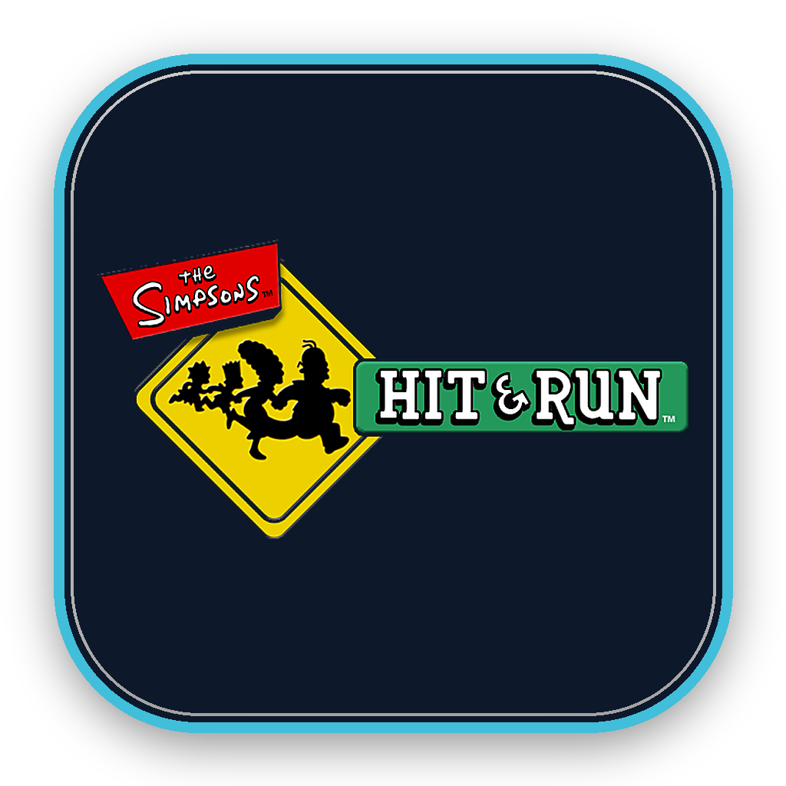

<p align="center">
  
</p>

# The Simpsons: Hit & Run - Apple Silicon port

Native Apple-platform porting workspace for the PC release of *The Simpsons: Hit & Run*.
The project is written around the original C++ game code and game data: it does **not**
use Wine, CrossOver, a Windows VM, or binary translation.


<p align="center">
  <strong>Download v0.5.0 for macOS Apple Silicon</strong><br>
  <a href="https://github.com/VHSMODDING/HitAndRun-macOS/releases/download/v0.5.0/HitAndRun-v0.5.0-macOS-arm64.dmg">Download DMG</a>
  &nbsp;·&nbsp;
  <a href="https://github.com/VHSMODDING/HitAndRun-macOS/releases/download/v0.5.0/HitAndRun-v0.5.0-macOS-arm64.002.dmgpart">Download required second part</a>
  &nbsp;·&nbsp;
  <a href="https://github.com/VHSMODDING/HitAndRun-macOS/releases/tag/v0.5.0">Release notes</a>
</p>

Download both files into the same folder without renaming them. Open the `.dmg`
and copy **The Simpsons Hit & Run.app** to Applications. Both downloads are required;
the second part is read automatically when opening the DMG.

This preview is for macOS Apple Silicon only. It is not notarized by Apple,
and gameplay is still under active validation.

---

## Status

| Platform | Architecture | Status |
| --- | --- | --- |
| macOS Sonoma / Sequoia | Apple Silicon (`arm64`) | Native bundle builds and launches; gameplay, input and HUD still under active validation. |
| iOS / iPadOS | `arm64` | Resources and Apple-platform input foundation prepared; no playable iOS build yet. |
| tvOS | `arm64` | Visual icon source prepared; no runtime port yet. |

The macOS target is the only runnable target today. iOS, iPadOS and tvOS are not
advertised as functional builds until the renderer, lifecycle and touch-control ports
have been completed and tested on device.

## Features in the macOS target

- Native `arm64` Cocoa application for Apple Silicon.
- Original PC data loaded directly, with no compatibility layer.
- GameController integration for Xbox, DualShock/DualSense and Switch Pro controllers.
- Keyboard (AZERTY and QWERTY) and trackpad input paths.
- CoreAudio sound backend and AVFoundation movie playback.
- Bundle staging that embeds a legally owned PC data copy in the `.app` package.
- Original PC icon converted to a macOS `.icns` bundle icon and an iOS/iPadOS app-icon catalog.

## Requirements

| Requirement | Version |
| --- | --- |
| macOS | Sonoma 14 or Sequoia 15 |
| Hardware | Apple Silicon Mac |
| Toolchain | Xcode 15+ and CMake |
| Game data | A legally owned PC copy of *The Simpsons: Hit & Run* |

## Build and launch

The local **v0.5.0 preview** is prepared with `bash port/macos/package-release.sh`.
It bundles libpng and produces an ad-hoc-signed `.app` plus segmented DMG files
in `dist/v0.5.0-upload`. Packaging does not upload anything to GitHub.
See [release notes](RELEASE-v0.5.0.md) for installation and known limitations.

```sh
cmake -S . -B build/macos-arm64 -DCMAKE_OSX_ARCHITECTURES=arm64
cmake --build build/macos-arm64 --target HitAndRunPortHost stage_game_data -j4
codesign --force --deep --sign - build/macos-arm64/HitAndRunPortHost.app
open build/macos-arm64/HitAndRunPortHost.app
```

The resulting application is located at:

`build/macos-arm64/HitAndRunPortHost.app`

`stage_game_data` copies `upstream/game/PC` into the bundle under
`Contents/Resources/GameData`. Alternatively set `HMR_DATA_ROOT` to use a separate
local PC-data directory during development.

## Apple resources

| Asset | Location |
| --- | --- |
| Original PC icon | `upstream/game/build/win32/Simpsons.ico` |
| Master PNG | `assets/icons/AppIcon-1024.png` |
| macOS bundle icon | `assets/icons/AppIcon.icns` |
| iOS / iPadOS asset catalog | `assets/icons/iOS/AppIcon.appiconset` |
| tvOS icon source | `assets/icons/tvOS` |

## Roadmap

1. Stabilise keyboard, controller and gameplay-state input on macOS.
2. Complete Pure3D OpenGL HUD, texture-alpha and Retina scaling compatibility.
3. Finish audio, movies and mission-flow validation.
4. Move the renderer from legacy OpenGL to Metal-compatible platform code.
5. Add iOS/iPadOS lifecycle, touch UI, controller and Metal rendering targets.
6. Add tvOS focus navigation, controller-only UI and layered tvOS artwork.

## Legal notice

*The Simpsons: Hit & Run*, its artwork, audio and game data remain the property of
their respective rights holders. This repository is a technical porting workspace and
does not grant any right to distribute the original game or its assets. Use it only
with a copy of the PC game that you are legally entitled to use.
